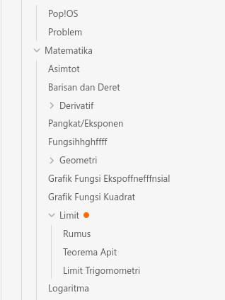
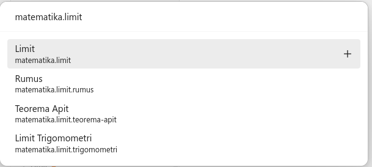
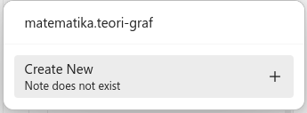

# Obsidian Dendron Tree

Obsidian Dendron Tree add tree for exploring [Dendron](https://www.dendron.so/) note.

Features:

- Dendron Tree  
  To view the Dendron Tree you can select "Open Dendron Tree" in Ribbon bar.

  Note with orange circle indicator
  () is note that does not have
  corresponding file.

  To open note file you can select note name in tree. This also expand the note in tree.

  To expand and collapse note you can select arrow () in left of
  note.

  You can right click on Desktop or long press on Mobile note to open note menu. Note menu will have
  following item:

  - "Create Current Note". This will create file for selected note. This only show when note does
    not have corresponding file.
  - "Create New Note". This will open Lookup with selected note's path as initial prompt. You can
    see lookup documentation on how to use it.
  - "Delete Note". This will delete selected note file. This only show when note have corresponding
    file.

- Lookup  
   

  To lookup note you can run command "Dendron Tree: Lookup Note". With this you can open and delete
  note.

  

  You can create note by inputting Dendron path that does not exist. Then you will get "Create New"
  item. Select this item to create new note.

  

  You can also select note that does not have corresponding file. Item that when is selected create
  new note is indicated by `+` icon at right.

  > It's reccomended to always input Dendron path in lookup modal.
